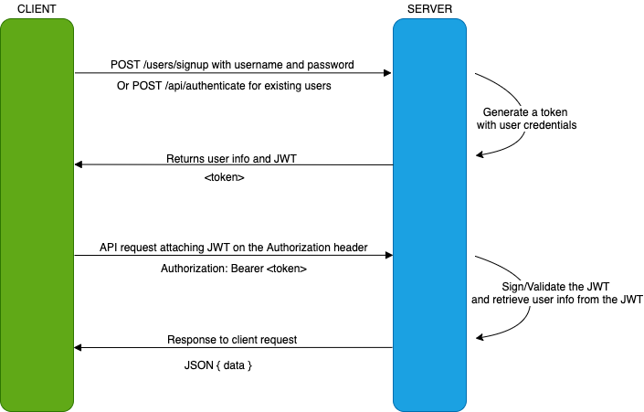

# Storage Manager

A highly available, highly scalable, cost effective 3 tier web application 
which would be accessible over public internet through http://chihoang.pro

To start the app on local, build and run `StorageManagerApplication` with below VM arg  
`-Dspring.profiles.active=local`

Or simply with Maven wrapper  
`./mvnw spring-boot:run -Dspring-boot.run.arguments=--spring.profiles.active=local`

Explore and test available APIs via Swagger documentation  
http://localhost:9000/swagger-ui.html

## APIs
Download [Postman](https://www.getpostman.com) and import below collection for a list of available APIs  
https://www.getpostman.com/collections/4e7d0b0af13dd3c7325f

## Authorization Flow

